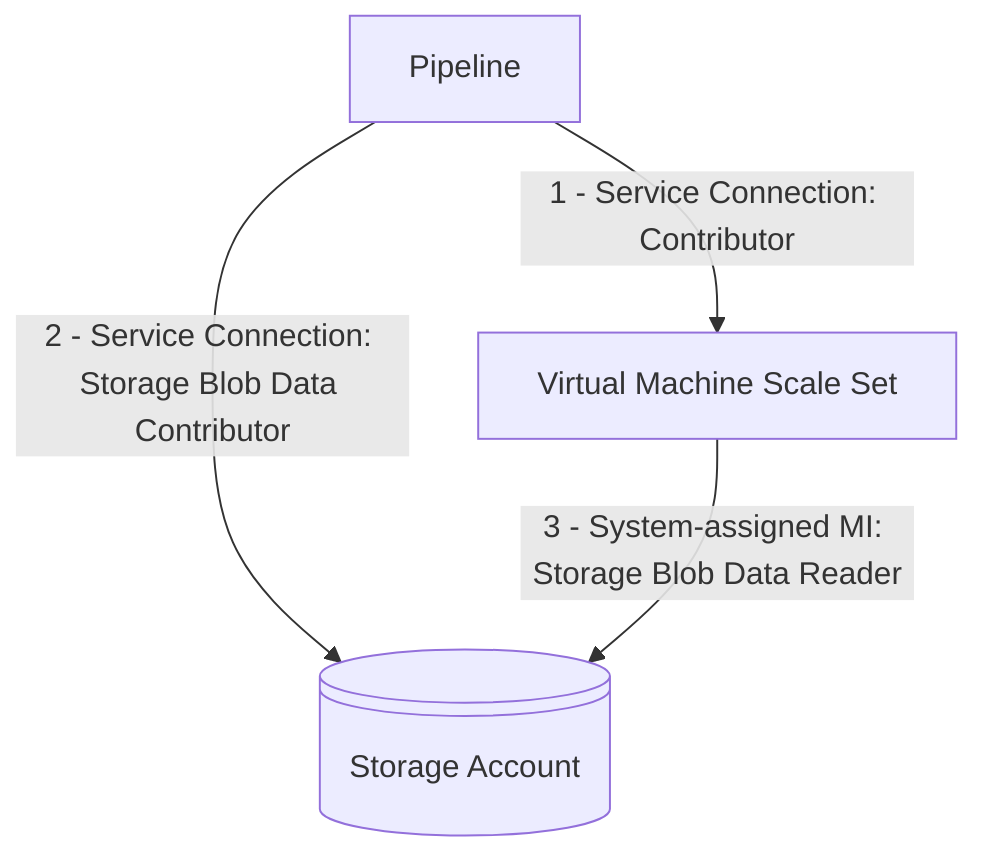

The following permissions are required for the `AzureVmssDeployment@1` task:

1. Service Connection: [Contributor](https://learn.microsoft.com/azure/role-based-access-control/built-in-roles/privileged#contributor) permission on the Virtual Machine Scale Set
1. Service Connection: [Storage Blob Data Contributor](https://learn.microsoft.com/azure/role-based-access-control/built-in-roles/storage#storage-blob-data-contributor) on the storage account that holds the script
1. Virtual Machine Scale Set System-assigned MI: [Storage Blob Data Reader](https://learn.microsoft.com/azure/role-based-access-control/built-in-roles/storage#storage-blob-data-reader) on the storage account that holds the script
